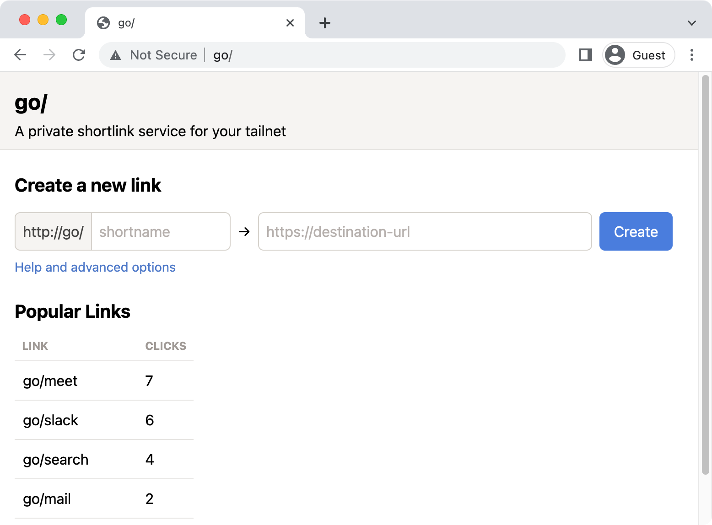

# golink

[](https://tailscale.com/kb/1167/release-stages/#experimental)

golink is a private shortlink service for your [tailnet].
It lets you create short, memorable links for the websites you and your team use most.
If you're new to golink, learn more in our [announcement blog post](https://tailscale.com/blog/golink/).
If you were looking for a SaaS go link service that doesn't use Tailscale,
you might be thinking of [golinks.io](https://golinks.io) or [trot.to](http://trot.to)

[tailnet]: https://tailscale.com/kb/1136/tailnet/



## Building and running

To build from source and run in dev mode:

    go run ./cmd/golink -dev-listen :8080

golink will be available at http://localhost:8080/,
storing links in a temporary database, and will not attempt to join a tailnet.

The equivalent using the pre-built docker image:

    docker run -it --rm -p 8080:8080 ghcr.io/tailscale/golink:main -dev-listen :8080

If you receive the docker error `unable to open database file: out of memory (14)`,
use a persistent volume as documented in [Running in production](#running-in-production).

## Joining a tailnet

Create an [auth key] for your tailnet at <https://login.tailscale.com/admin/settings/keys>.
Configure the auth key to your preferences, but at a minimum we generally recommend:

 - add a [tag] (maybe something like `tag:golink`) to make it easier to set ACLs for controlling access and to ensure the node doesn't expires.
 - don't set "ephemeral" so the node isn't removed if it goes offline

Once you have a key, set it as the `TS_AUTHKEY` environment variable when starting golink.
You will also need to specify your sqlite database file:

    TS_AUTHKEY="tskey-auth-<key>" go run ./cmd/golink -sqlitedb golink.db

golink stores its tailscale data files in a `tsnet-golink` directory inside [os.UserConfigDir].
As long as this is on a persistent volume, the auth key only needs to be provided on first run.

[auth key]: https://tailscale.com/kb/1085/auth-keys/
[tag]: https://tailscale.com/kb/1068/acl-tags/
[os.UserConfigDir]: https://pkg.go.dev/os#UserConfigDir

## MagicDNS

When golink joins your tailnet, it will attempt to use "go" as its node name,
and will be available at http://go.tailnet0000.ts.net/ (or whatever your tailnet name is).
To make it accessible simply as http://go/, enable [MagicDNS] for your tailnet.
With MagicDNS enabled, no special configuration or browser extensions are needed on client devices.
Users just need to have Tailscale installed and connected to the tailnet.

[MagicDNS]: https://tailscale.com/kb/1081/magicdns/

## Running in production

golink compiles as a single static binary (including the frontend) and can be deployed and run like any other binary.
Two pieces of data should be on persistent volumes:

 - tailscale data files in the `tsnet-golink` directory inside [os.UserConfigDir]
 - the sqlite database file where links are stored

In the docker image, both are stored in `/home/nonroot`, so you can mount a persistent volume:

    docker run -v /persistent/data:/home/nonroot ghcr.io/tailscale/golink:main

The mounted directory will need to be writable by the nonroot user (uid: 65532, gid: 65532),
for example by calling `sudo chown 65532 /persistent/data`.
Alternatively, you can run golink as root using `docker run -u root`.

No ports need to be exposed, whether running as a binary or in docker.
golink will listen on port 80 on the tailscale interface, so can be accessed at http://go/.

<details>
  <summary>Deploy on Fly</summary>

  See <https://fly.io/docs/> for full instructions for deploying apps on Fly, but this should give you a good start.
  Replace `FLY_APP_NAME` and `FLY_VOLUME_NAME` with your app and volume names.

  Create a [fly.toml](https://fly.io/docs/reference/configuration/) file:

  ``` toml
app = "FLY_APP_NAME"

[build]
image = "ghcr.io/tailscale/golink:main"

[deploy]
strategy = "immediate"

[mounts]
source="FLY_VOLUME_NAME"
destination="/home/nonroot"
```

  Then run the commands with the [flyctl CLI].

  ``` sh
  $ flyctl apps create FLY_APP_NAME
  $ flyctl volumes create FLY_VOLUME_NAME
  $ flyctl secrets set TS_AUTHKEY=tskey-auth-<key>
  $ flyctl deploy
  ```

[flyctl CLI]: https://fly.io/docs/hands-on/install-flyctl/

</details>

## Backups

Once you have golink running, you can backup all of your links in [JSON lines] format from <http://go/.export>.
At Tailscale, we snapshot our links weekly and store them in git.

To restore links, specify the snapshot file on startup.
Only links that don't already exist in the database will be added.

    golink -snapshot links.json

[JSON lines]: https://jsonlines.org/

You can also resolve links locally using a snapshot file:

    golink -resolve-from-backup links.json go/link

## Firefox configuration

If you're using Firefox, you might want to configure two options to make it easy to load links:
    
  * to prevent `go/` page loads from the address bar being treated as searches,
    navigate to `about:config` and add a boolean setting `browser.fixup.domainwhitelist.go`
    with a value of _true_

  * if you use HTTPS-Only Mode, [add an exception](https://support.mozilla.org/en-US/kb/https-only-prefs#w_add-exceptions-for-http-websites-when-youre-in-https-only-mode)
